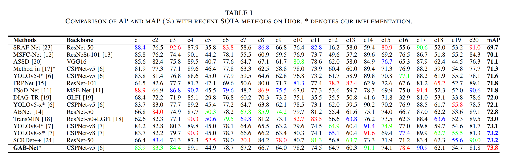

# GAB-Net
* Author list: Hongyu Zhang, Yunbo Rao, Jie Shao, Fanman Meng, Naveed Ahmad
* This is the implementation code for paper: "GAB-Net: A Robust Detector for Remote Sensing Object Detection under Dramatic Sacle Variation and Complex Background" in journal "IEEE Geoscience and Remote Sensing Letters"

## Overview
<p align="center">  </p>

## Performance
<p align="center">  </p>

## Installation
Please find the detailed installation information in [Install.md](./Installation.md).

## Usage
### Dataset preparation
Please download the official datasets:

NWPU VHR-10 & Dior: https://gcheng-nwpu.github.io/#Datasets

```
Dior/NWPU VHR-10
├── train
│   ├── images
│   └── labels
└── val
|   ├── images
|   └── labels
└── test
    ├── images
    └── labels

```
Put the formatted datasets at
```
 [Your Path]/ultralytics/Dior
 [Your Path]/ultralytics/NWPU
```

### Training
The training command is conducted under ultralytics framework.
```
yolo task=detect mode=train model=models/v8/GAB-Net.yaml data=yolo/data/datasets/Dior.yaml  epochs=160 batch=16
```
### Testing
After finishing training, you can find the weight and relevant analysis files at:
```
[Your Path]/ultralytics/ultralytics/runs/detect/[train file]
```
Then conduct the testing command to obtain mAP, FPS, and Parameters simultaneously.
```
yolo task=detect mode=val model=runs/detect/[train file]/weights/best.pt data=yolo/data/datasets/Dior.yaml  batch=16 split=test
```

## Visulization results
<p align="center">  </p>

## Acknowledgement
This work is implemented under the framework: [ultralytics](https://github.com/ultralytics/ultralytics). We appreciate the contributors for the construction of framework and useful toolbox!

## Citation
If you find our work useful, please cite our paper:
```bibtex
@ARTICLE{10286841,
  author={Zhang, Hongyu and Rao, Yunbo and Shao, Jie and Meng, Fanman and Ahmad, Naveed},
  journal={IEEE Geoscience and Remote Sensing Letters}, 
  title={GAB-Net: A Robust Detector for Remote Sensing Object Detection Under Dramatic Scale Variation and Complex Backgrounds}, 
  year={2023},
  volume={20},
  number={},
  pages={1-5},
  doi={10.1109/LGRS.2023.3325410}}

```


